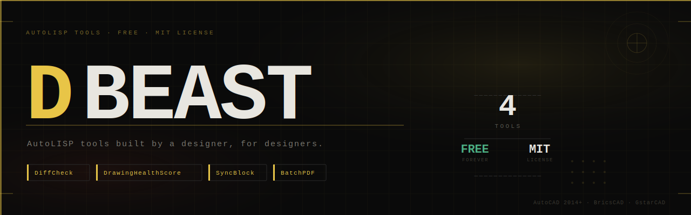

<div align="center">



<br><br>

**Free AutoLISP tools built by a designer, for designers.** No plugins. No subscriptions. Download a `.lsp` file and run.

<br>


[](https://ko-fi.com/beastt1992)

</div>

---

### ▤ [SectionDraft](https://github.com/beastt1992/SectionDraft)

**Draw one cut line. Let the algorithm build the rest.**

Instantly generate fully drafted, BIM-level vertical sections from 2D floor plans. Uses semantic ray-casting to auto-detect walls, parapets, and doors, while automatically generating slabs and 2cm plaster lines.

`SECDRAFT`

---

### ⬡ [DiffCheck](https://github.com/beastt1992/DiffCheck)

**Auto-mark revision clouds for design changes**

Select old and new regions in the same DWG — red revision clouds appear instantly around every change. No more hand-circling.

`DFC` `DFCC` `DFCT`

---

### ◈ [DrawingHealthScore](https://github.com/beastt1992/DrawingHealthScore)

**Scan any DWG and get a health score out of 100**

8-point diagnostic dashboard — unused layers, unpurged blocks, file weight, xrefs — with one-click fix and MB savings display.

`DHS` `DHSFIX`

---

### ◫ [SyncBlock](https://github.com/beastt1992/SyncBlock-AutoCAD)

**One master block. Everything else syncs automatically.**

One base plan, multiple review versions (fire, accessibility, area). Change the master, run SyncNow — all child blocks update instantly.

`SyncNow` `SFM`

---

### ▣ [BatchPDF](https://github.com/beastt1992/autocad-batch-plot)

**Batch export all title block frames to individual PDFs**

Built for the Model Space workflow common in Taiwan and Asia. Pick a frame, set scale and output folder, export all sheets at once.

`BPDF`

---

## Installation

```text
1.  Download the .lsp file from any repo above
2.  In AutoCAD, type APPLOAD and load the file
3.  Run the command listed above
```

💡 Add to **Startup Suite** in APPLOAD for automatic loading every session.

---

<div align="center">

**If these tools saved you time, consider buying me a coffee ☕**

[](https://ko-fi.com/beastt1992)

<br>

*AutoLISP · MIT License · AutoCAD 2014+, BricsCAD, GstarCAD*

</div>

